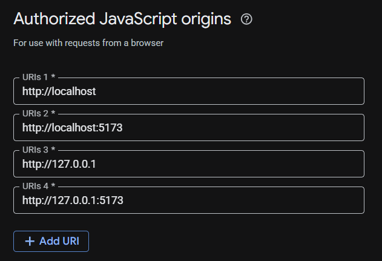

# Getting Started

### Reference Documentation
For further reference, please consider the following sections:

* [Official Gradle documentation](https://docs.gradle.org)
* [Spring Boot Gradle Plugin Reference Guide](https://docs.spring.io/spring-boot/4.0.0/gradle-plugin)
* [Create an OCI image](https://docs.spring.io/spring-boot/4.0.0/gradle-plugin/packaging-oci-image.html)
* [Spring Web](https://docs.spring.io/spring-boot/4.0.0/reference/web/servlet.html)
* [JDBC API](https://docs.spring.io/spring-boot/4.0.0/reference/data/sql.html)
* [Spring Data JPA](https://docs.spring.io/spring-boot/4.0.0/reference/data/sql.html#data.sql.jpa-and-spring-data)

### Guides
The following guides illustrate how to use some features concretely:

* [Building a RESTful Web Service](https://spring.io/guides/gs/rest-service/)
* [Serving Web Content with Spring MVC](https://spring.io/guides/gs/serving-web-content/)
* [Building REST services with Spring](https://spring.io/guides/tutorials/rest/)
* [Accessing Relational Data using JDBC with Spring](https://spring.io/guides/gs/relational-data-access/)
* [Managing Transactions](https://spring.io/guides/gs/managing-transactions/)
* [Accessing Data with JPA](https://spring.io/guides/gs/accessing-data-jpa/)

### Additional Links
These additional references should also help you:

* [Gradle Build Scans – insights for your project's build](https://scans.gradle.com#gradle)
---
### Swagger
Test API

* Read form this (https://springdoc.org/#swagger-ui-support)
* In file `build.gradle` Add `implementation 'org.springdoc:springdoc-openapi-starter-webmvc-ui:2.8.14'` in dependencies.

### JWT
Add JWT for authentication - create and verify token.  
* Update `application.properties`
```
app.security.jwt.secret=secret-key
app.security.jwt.access-expiration-minutes=03
app.security.jwt.refresh-expiration-days=7
app.security.jwt.issuer=my-app
```
* Update `build.gradle`
```
	implementatio n 'io.jsonwebtoken:jjwt-api:0.11.5'
	runtimeOnly 'io.jsonwebtoken:jjwt-impl:0.11.5'
    runtimeOnly 'io.jsonwebtoken:jjwt-jackson:0.11.5'
```
* Add `JWTService` for generate access and refresh token, verify token.

### Spring Security
* Add dependencies, method `SecurityFilterChain` in `SecurityConfig`
* `JwtAuthenticationFilter` – bridge between JWT & Spring Security

### Google OAuth
* Log in (https://console.cloud.google.com/)
* create project
* In Clients update `Authorized JavaScript origins`

* Set up in `application.properties`
* Create `AuthService`
